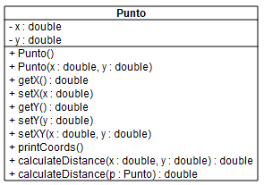
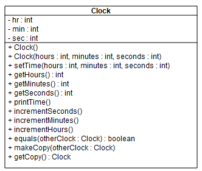

# Ejemplos hechos en bluej #

* **Nota**: Decargar la herramienta bluej ([link](https://bluej.org/)) para poder analizarlos de acuerdo a las instrucciones dadas en clase.

## Diagramas UML ##

### Punto ###

### Reloj ###

