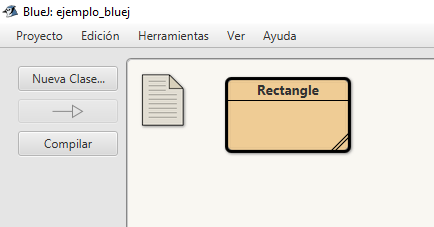

# Ejemplo 

* **Fecha**: 21/07/2021


## Descripción ## 

Archivo que describe una clase rectangulo.



## Codigos ##

* **Archivo**: [Rectangle.java](./code/Rectangle.java)


```java
public class Rectangle {
    // Atributos
    private double length;
    private double width;
    
    // Constructores
    public Rectangle() {
        length = 1;
        width = 1;
    }
    
    public Rectangle(double l) {
        length = l;
        width = l;
    }
    
    public Rectangle(double len, double w) {
        length = len;
        width = w;
    }
  
    // Metodos
    public void setLength(double len) {
        length = len;
    }
    
    public void setWidth(double w) {
        width = w;
    }
    
    public double getLength() {    
        return length;
    }
    
    public double getWidth() {    
        return width;
    }
    
    public double getArea() {    
        return width*length;
    }
}
```