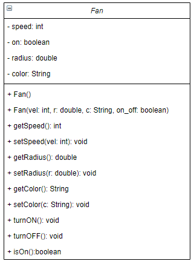

# Ejemplo #

* **Fecha**: 23/07/2021

Codigo que modela un ventilador

## Diagram UML ##



## Código ##

* **Archivo 1**: [Fan.java](Fan.java)

```java
public class Fan {

    // instance variables - replace the example below with your own
    private int speed;   // SLOW = 1, MEDIUM = 2, FAST = 3
    private boolean on;
    private double radius;
    private String color;

    /**
     * Constructor for objects of class Fan
     */
    public Fan() {
        // initialise instance variables
        speed = 1; // SLOW = 1
        radius = 5;
        color = "Blue";
        on = false;
    }

    public Fan(int   vel, double r, String c, boolean on_off) {
        // initialise instance variables
        speed = vel;
        radius = r;
        color = c;
        on = on_off;
    }

    /**
     * Metodos
     */
    public int getSpeed() {
        return speed;
    }

    public void setSpeed(int vel) {
        speed = vel;
    }

    public double getRadius() {
        return radius;
    }

    public void setRadius(double r) {
        radius = r;
    }

    public String getColor() {
        return color;
    }

    public void setColor(String c) {
        color = c;
    }

    public void turnON() {
        on = true;
    }

    public void turnOFF() {
        on = false;
    }

    public boolean isON() {
        return on;
    }
}
```

* **Archivo 2**: [TestFan.java](TestFan.java)

```java
public class TestFan {
     public static void main(String[] args) {
        // Creacion de los objetos
        Fan fan1 = new Fan(3, 10, "yellow", true);
        Fan fan2 = new Fan(2, 5, "blue", false);
        
        // Despliegue de las propiedades (get)
        // fan1
        System.out.println("Propiedades de Fan 1");
        System.out.print("- Velociadad: ");
        if (fan1.getSpeed() == 1) {
            System.out.println("SLOW");
        }
        else if (fan1.getSpeed() == 2) {
            System.out.println("MEDIUM");     
        }
        else if (fan1.getSpeed() == 3) {
            System.out.println("FAST");     
        }
        System.out.println("- Radio: " + fan1.getRadius());
        System.out.println("- Color: " + fan1.getColor());
        System.out.print("- Estado: ");
        if (fan1.isON()) {
            System.out.println("Encendido");        
        } else {
            System.out.println("Apagado");     
        } 
        System.out.println();
        // fan1
        System.out.println("Propiedades de Fan 2");
        System.out.print("- Velociadad: ");
        /*
        if (fan2.getSpeed() == 1) {
            System.out.println("SLOW");
        }
        else if (fan2.getSpeed() == 2) {
            System.out.println("MEDIUM");     
        }
        else if (fan2.getSpeed() == 3) {
            System.out.println("FAST");     
        }
        */
        switch(fan2.getSpeed()){
            case 1:
                System.out.println("SLOW");
                break;
            case 2:
                System.out.println("MEDIUM");
                break;
            case 3:
                System.out.println("FAST");
                break;
        }
        System.out.println("- Radio: " + fan2.getRadius());
        System.out.println("- Color: " + fan2.getColor());
        System.out.print("- Estado: ");
        if (fan2.isON()) {
            System.out.println("Encendido");        
        } else {
            System.out.println("Apagado");     
        } 
        System.out.println();
         
    }
}
```

* **Archivo 2**: [TestFan2.java](TestFan2.java)

```java
public class TestFan2 {

    // Imprimir estado
    public static void imprimirEstado(boolean on) {
        if (on) {
            System.out.println("Encendido");
        } else {
            System.out.println("Apagado");
        }
    }

    // Imprimir velocidad
    public static void imprimirVelocidad(int vel) {
        switch (vel) {
            case 1:
                System.out.println("SLOW");
                break;
            case 2:
                System.out.println("MEDIUM");
                break;
            case 3:
                System.out.println("FAST");
                break;
        }
    }

    // Metodo principal
    public static void main(String[] args) {
        // Creacion de los objetos
        Fan fan1 = new Fan(3, 10, "yellow", true);
        Fan fan2 = new Fan(2, 5, "blue", false);

        // Despliegue de las propiedades (get)
        // fan1
        System.out.println("Propiedades de Fan 1");
        System.out.print("- Velociadad: ");
        imprimirVelocidad(fan1.getSpeed());
        System.out.println("- Radio: " + fan1.getRadius());
        System.out.println("- Color: " + fan1.getColor());
        System.out.print("- Estado: ");
        imprimirEstado(fan1.isON());
        System.out.println();
        // fan1
        System.out.println("Propiedades de Fan 2");
        System.out.print("- Velociadad: ");
        imprimirVelocidad(fan2.getSpeed());
        System.out.println("- Radio: " + fan2.getRadius());
        System.out.println("- Color: " + fan2.getColor());
        System.out.print("- Estado: ");
        imprimirEstado(fan2.isON());
        System.out.println();

    }
}
```
